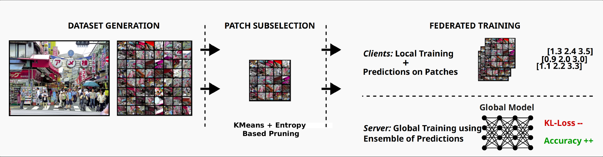

# Federated Learning with a Single Shared Image

Original work, published in CVPR'24 Workshop Proceedings [[Paper](https://arxiv.org/abs/2406.12658)]



## Abstract

Federated Learning (FL) enables multiple machines to collaboratively train a machine learning model without sharing of private training data. Yet, especially for heterogeneous models, a key bottleneck remains the transfer of knowledge gained from each client model with the server. One popular method, FedDF, uses distillation to tackle this task with the use of a common, shared dataset on which predictions are exchanged. However, in many contexts such a dataset might be difficult to acquire due to privacy and the clients might not allow for storage of a large shared dataset. To this end, in this paper, we introduce a new method that improves this knowledge distillation method to only rely on a single shared image between clients and server. In particular, we propose a novel adaptive dataset pruning algorithm that selects the most informative crops generated from only a single image. With this, we show that federated learning with distillation under a limited shared dataset budget works better by using a single image compared to multiple individual ones. Finally, we extend our approach to allow for training heterogeneous client architectures by incorporating a non-uniform distillation schedule and client-model mirroring on the server side.

## Results at a Glance

The following table shows test evaluation comparison using CIFAR10 dataset for private data emulation using ResNet-8 architecture during 30 rounds of federated training, using our method against an existing naive approach. [Full results in the official paper]

| Shared Dataset                        | No. of Shared Pixels | Accuracy |
| ------------------------------------- | -------------------- | :------: |
| CIFAR100 Test Samples (500)           | 0.5 Million          |  73.3 %  |
| CIFAR100 Test Samples (5000)          | 5 Million            |  75.7 %  |
| **Single Image with Patch Selection** | 0.5 Million          |  76.4 %  |

## Project Implementation

To conduct our research and experimentation, we have made use of [Flower Framework](https://github.com/adap/flower) alongside vanilla [PyTorch](https://github.com/pytorch/pytorch) and required libraries in this project.

`simulate.py` is the entrypoint code, which begins the experiment and finishes with the output of the results according to your experiment settings.

There's a large list of associated arguments which can be passed to setup your experiment the way you want to. The description and their usage has been integrated in the argument parser itself, which can be accessed with `python simulate.py --help`

<details>

<summary> <b>Complete Snippet of simulate.py Usage</b> </summary>

```
usage: simulate.py [-h] [--fed_strategy FED_STRATEGY] [--model_name MODEL_NAME] [--model_list MODEL_LIST] [--num_clients NUM_CLIENTS] [--num_rounds NUM_ROUNDS] [--fraction_fit FRACTION_FIT] [--fraction_evaluate FRACTION_EVALUATE]
                   [--dataset_name DATASET_NAME] [--data_dir DATA_DIR] [--partition_alpha PARTITION_ALPHA] [--partition_val_ratio PARTITION_VAL_RATIO] [--client_cpus CLIENT_CPUS] [--client_gpus CLIENT_GPUS] [--server_cpus SERVER_CPUS]
                   [--total_cpus TOTAL_CPUS] [--total_gpus TOTAL_GPUS] [--total_mem TOTAL_MEM] [--batch_size BATCH_SIZE] [--local_epochs LOCAL_EPOCHS] [--local_lr LOCAL_LR] [--distill_batch_size DISTILL_BATCH_SIZE]
                   [--server_lr SERVER_LR] [--server_steps SERVER_STEPS] [--server_steps_adaptive SERVER_STEPS_ADAPTIVE] [--server_steps_adaptive_min SERVER_STEPS_ADAPTIVE_MIN]
                   [--server_steps_adaptive_interval SERVER_STEPS_ADAPTIVE_INTERVAL] [--server_early_steps SERVER_EARLY_STEPS] [--use_early_stopping USE_EARLY_STOPPING] [--use_adaptive_lr USE_ADAPTIVE_LR]
                   [--use_adaptive_lr_round USE_ADAPTIVE_LR_ROUND] [--seed SEED] [--cuda_deterministic CUDA_DETERMINISTIC] [--use_crops USE_CROPS] [--distill_dataset DISTILL_DATASET] [--distill_alpha DISTILL_ALPHA]
                   [--num_distill_images NUM_DISTILL_IMAGES] [--num_total_images NUM_TOTAL_IMAGES] [--distill_transforms DISTILL_TRANSFORMS] [--warm_start WARM_START] [--warm_start_rounds WARM_START_ROUNDS]
                   [--warm_start_interval WARM_START_INTERVAL] [--kmeans_n_clusters KMEANS_N_CLUSTERS] [--kmeans_heuristics KMEANS_HEURISTICS] [--kmeans_mixed_factor KMEANS_MIXED_FACTOR] [--kmeans_balancing KMEANS_BALANCING]
                   [--use_kmeans USE_KMEANS] [--confidence_threshold CONFIDENCE_THRESHOLD] [--confidence_strategy CONFIDENCE_STRATEGY] [--confidence_adaptive CONFIDENCE_ADAPTIVE] [--confidence_max_thresh CONFIDENCE_MAX_THRESH]
                   [--use_entropy USE_ENTROPY] [--clipping_factor CLIPPING_FACTOR] [--use_clipping USE_CLIPPING] [--fedprox_factor FEDPROX_FACTOR] [--fedprox_adaptive FEDPROX_ADAPTIVE] [--use_fedprox USE_FEDPROX] [--debug DEBUG]
                   [--out_dir OUT_DIR]

Single Image based fed learning simulation using Flower.

options:
  -h, --help            show this help message and exit
  --fed_strategy FED_STRATEGY
                        Federated Strategy to use. Options : fedavg, feddf, feddf_hetero
  --model_name MODEL_NAME
                        Common NN architecture for clients and server (fedavg/feddf). Options : resnet[n], wresnet-[n]-[m]. Example : resnet8, wresnet-16-4
  --model_list MODEL_LIST
                        NN architecture distribuition (feddf_hetero). Example : {'resnet8':5,'wresnet-16-4':5}
  --num_clients NUM_CLIENTS
                        Total number of clients.
  --num_rounds NUM_ROUNDS
                        Total number of federated rounds.
  --fraction_fit FRACTION_FIT
                        Ratio of clients to be selected for training every round.
  --fraction_evaluate FRACTION_EVALUATE
                        Ratio of clients for client-evaluation every round.
  --dataset_name DATASET_NAME
                        Target dataset. Options : cifar10, cifar100, pathmnist, organamnist, pneumoniamnist
  --data_dir DATA_DIR   Relative location of directory to download datasets.
  --partition_alpha PARTITION_ALPHA
                        Dirichtlet distribuition alpha for private dataset distribuition.
  --partition_val_ratio PARTITION_VAL_RATIO
                        Ratio of validation examples from training set.
  --client_cpus CLIENT_CPUS
                        Number of available cpus to each client.
  --client_gpus CLIENT_GPUS
                        Number of available gpus to each client. Fraction acceptable.
  --server_cpus SERVER_CPUS
                        Number of cpus available to central server.
  --total_cpus TOTAL_CPUS
                        Total number of cpus on the machine.
  --total_gpus TOTAL_GPUS
                        Total number of gpus on the machine.
  --total_mem TOTAL_MEM
                        Total size of RAM on the machine (in gigabytes/ integer).
  --batch_size BATCH_SIZE
                        Batch size for local training.
  --local_epochs LOCAL_EPOCHS
                        Number of epochs for local training.
  --local_lr LOCAL_LR   LR for local training.
  --distill_batch_size DISTILL_BATCH_SIZE
                        Batch size for global model training (server).
  --server_lr SERVER_LR
                        LR for global model training.
  --server_steps SERVER_STEPS
                        Number of distillation steps (feddf).
  --server_steps_adaptive SERVER_STEPS_ADAPTIVE
                        Enable/disable adaptive number of steps (feddf). Options : True/False
  --server_steps_adaptive_min SERVER_STEPS_ADAPTIVE_MIN
                        Number of minimum distillation steps (adaptive).
  --server_steps_adaptive_interval SERVER_STEPS_ADAPTIVE_INTERVAL
                        Interval to change number of steps (adaptive).
  --server_early_steps SERVER_EARLY_STEPS
                        Number of plateau steps for early stopping.
  --use_early_stopping USE_EARLY_STOPPING
                        Enable/disable early stopping (feddf). Options : True/False
  --use_adaptive_lr USE_ADAPTIVE_LR
                        Enable/disable adaptive lr (local model training). Options : True/False
  --use_adaptive_lr_round USE_ADAPTIVE_LR_ROUND
                        Enable/disable adaptive lr (global model training). Options : True/False
  --seed SEED           Seed for RNG (for reproducible results)
  --cuda_deterministic CUDA_DETERMINISTIC
                        Enable deterministic CUDA algorithms. Slow but deterministic.
  --use_crops USE_CROPS
                        Enable/disable use of single image crops (feddf). Options : True/False
  --distill_dataset DISTILL_DATASET
                        Dataset for distillation (if not using single image crops). Options same as dataset_name.
  --distill_alpha DISTILL_ALPHA
                        Dirichtlet dist. alpha for distillation dataset selection.
  --num_distill_images NUM_DISTILL_IMAGES
                        Size of dataset used as distillation proxy (feddf/ integer).
  --num_total_images NUM_TOTAL_IMAGES
                        Total number of images in distillation set.
  --distill_transforms DISTILL_TRANSFORMS
                        (experimental) changing transforms on image. Options: v0/v1
  --warm_start WARM_START
                        Enable/Disable warm start for FedDF. Options : True/False
  --warm_start_rounds WARM_START_ROUNDS
                        Number of total rounds for warm start.
  --warm_start_interval WARM_START_INTERVAL
                        Interval of rounds between warm starts.
  --kmeans_n_clusters KMEANS_N_CLUSTERS
                        Number of cluster (k) for KMeans selection.
  --kmeans_heuristics KMEANS_HEURISTICS
                        Heuristics for KMeans Selection. Options : mixed, easy, hard
  --kmeans_mixed_factor KMEANS_MIXED_FACTOR
                        Ratio for mixed heuristic. Example : 50-50
  --kmeans_balancing KMEANS_BALANCING
                        Ratio for class balancing in KMeans selection. Example : 0.5
  --use_kmeans USE_KMEANS
                        Enable/Disable KMeans selection for data pruning. Options : True/False
  --confidence_threshold CONFIDENCE_THRESHOLD
                        Confidence Threshold for Entropy selection.
  --confidence_strategy CONFIDENCE_STRATEGY
                        Heuristics for Entropy Selection. Options : top, bottom, random
  --confidence_adaptive CONFIDENCE_ADAPTIVE
                        Disable/Enable adaptive threshold (entropy). Options : True/False
  --confidence_max_thresh CONFIDENCE_MAX_THRESH
                        Max threshold for adaptive pruning. Example : 0.5
  --use_entropy USE_ENTROPY
                        Enable/Disable entropy selection for data pruning. Options : True/False
  --clipping_factor CLIPPING_FACTOR
                        Value for clipping factor (logit clipping)
  --use_clipping USE_CLIPPING
                        Enable/Disable use of logit clipping (for stability of learning)
  --fedprox_factor FEDPROX_FACTOR
                        Factor value for fedprox strategy.
  --fedprox_adaptive FEDPROX_ADAPTIVE
                        Enable/Disable adaptive fedprox factor. Options : True/False
  --use_fedprox USE_FEDPROX
                        Enable/Disable use of fedprox term with FedAvg. Options : True/False
  --debug DEBUG         Enable/Disable debugging console messages. Options : True/False
  --out_dir OUT_DIR     Relative directory location for outputting results of the experiment.
```

</details><br/>
Alternatively, have a look at `local_simulate.sh` bash script for an example on how to conduct an experiment using our code.

### Setting up the environment and Running experiments

Using `environment.yml` , a new conda environment can be created with all the required python libraries used during the development of this project.

#### Conducting an experiment

1. Produce the single image crops using `make_single_img_dataset.py`. Refer to the `--help` argument to find the complete list of arguments passable to the script.
2. Conduct federated learning experiments using `simulate.py` using your settings.
3. The results are output on the console which can be written to a text file using your preferred bash procedure.

#### Work-around for fixing GPU memory leak (flwr simulation)

1. Find the `ray_client_proxy.py` in your local pkg installation directory of python packages under the folder `"flwr/simulation/ray_transport/"`.
2. Replace `@ray.remote()` before `'launch_and_XXX'` methods to `@ray.remote(max_calls=1)`
3. Save the file and execute the main simulation python script of our project as usual from now on.

### Supported Model Architectures and Datasets

#### Model Architectures

Our project supports the following model architectures for client and global models during simulation: ResNet [[Paper](https://arxiv.org/abs/1512.03385)], Wide-Resnet [[Paper](https://arxiv.org/abs/1605.07146)].

There's no pretraining involved and we train the models from scratch during the simulation.

#### Datasets

Our project supports the following public datasets for emulating private data and evaluation purposes during simulation: CIFAR10/100 [[Link](https://www.cs.toronto.edu/~kriz/cifar.html)]; MedMNIST [[Link](https://github.com/MedMNIST/MedMNIST)] subset including PneumoniaMNIST, PathMNIST and OrganAMNIST.

## Reference

```
@inproceedings{soni2024federated,
  title={Federated Learning with a Single Shared Image},
  author={Sunny Soni and Aaqib Saeed and Yuki M. Asano},
  booktitle={CVPR Workshop Proceedings},
  year={2024},
}
```
